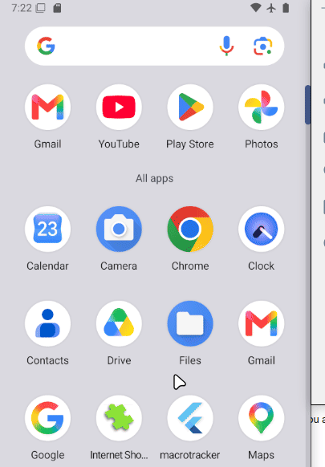

# Site Shortcuts

Site Shortcuts is a simple Flutter app for saving frequently visited websites as large, easy-to-tap buttons. Tapping a button opens the site in the device’s default browser.

## Why?

Site Shortcuts was built to give a familiar, straightforward way to bookmark websites: open one app, find the site, and tap its button.

## Features

- Add a website using a name and URL.
- See saved websites in a grid of large buttons.
- Tap a button to open its website in the default browser.
- Edit or remove shortcuts in a separate edit mode, with confirmation before removal.
- Keep saved shortcuts on the device between app launches.
- Use larger text and touch targets, with screen-reader labels on shortcut buttons.

## Built with

- **Flutter and Dart** for the app
- **shared_preferences** to save shortcuts locally
- **url_launcher** to open websites in the browser

The app does not require an account or a server.

## Run the project

You’ll need the [Flutter SDK](https://docs.flutter.dev/get-started/install) and a configured device or emulator.

```bash
git clone https://github.com/SaMorris-hash/Site-Shortcuts.git
cd Site-Shortcuts
flutter pub get
flutter run
```

To build an Android APK:

```bash
flutter build apk --release
```

The APK will be created at `build/app/outputs/flutter-apk/app-release.apk`.

## How to use it

1. Tap **Add site** and enter a name and website address.
2. Tap the site’s button whenever you want to open it in your browser.
3. Tap the pencil icon to edit or remove saved sites. Tap the check icon to leave edit mode.

